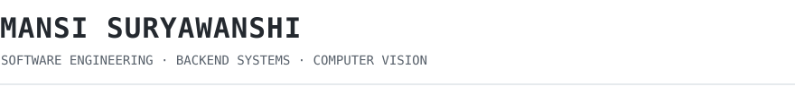
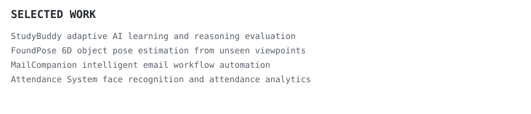
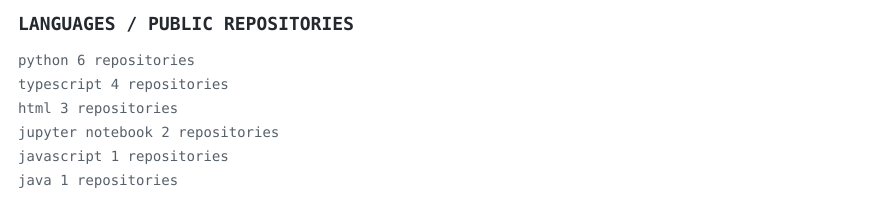

<a href="https://www.linkedin.com/in/mansi-suryawanshi/">linkedin</a> ·
<a href="https://mansi-suryawanshi.vercel.app/">portfolio</a> ·
<a href="mailto:ms.mansi.suryawanshi@gmail.com">email</a>

 

  

> MS Computer Science student at USC with 3.5 years of software engineering experience.
> I build reliable backend systems and applied AI that can survive outside a demo.

My work sits where software engineering meets intelligent systems: Java and Spring Boot services, cloud infrastructure, computer vision, and AI products designed around real users. I am currently exploring full-time software engineering, backend, and applied AI opportunities.

`python` &nbsp; `java` &nbsp; `c++` &nbsp; `typescript` &nbsp; `spring boot` &nbsp; `react` &nbsp; `aws` &nbsp; `docker` &nbsp; `postgresql` &nbsp; `git` &nbsp; `linux`

### SELECTED WORK

[**StudyBuddy**](https://github.com/MansiSuryawanshi/StudyBuddy) · `react, typescript, node.js, claude api`  
An adaptive learning system that evaluates reasoning depth, detects conceptual gaps, and challenges students with targeted follow-up questions.

[**FoundPose research**](https://github.com/MansiSuryawanshi) · `python, c++, dinov2, faiss, opencv`  
Adapted a 6D pose-estimation pipeline to custom physical objects using RGB images, segmentation masks, camera calibration, CAD models, feature retrieval, and RANSAC-PnP.

[**MailCompanion**](https://github.com/MansiSuryawanshi/MailCompanion) · `python, nlp`  
An intelligent email companion focused on reducing repetitive work and making communication easier to manage.

[**Automated Attendance**](https://github.com/MansiSuryawanshi/Attendence-System-Using-Automated-Face-Recognition-python) · `python, computer vision`  
A face-recognition workflow for automated attendance capture and reporting.

 

Every graphic in this README is stored in this repository. The portrait is generated from a photo using a monochrome character ramp and animates with SVG SMIL; the repository graphics refresh daily using GitHub Actions.
